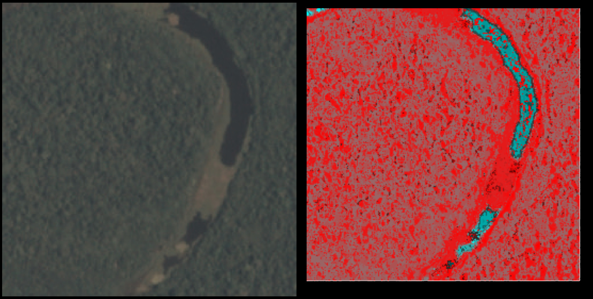

# Sam Wighton 

Page not yet finished 

Sam Wighton is a programmer with skills focused on system programming and learning from data

[Professional Career](/#professional-career) |
[Hobbies](/#hobbies) |
[Side Projects](/#side-projects)

## Professional Career

### Current Employment at [Accelo](https://www.accelo.com/)

Employed as a full stack developer.

This job involves writing code and unit tests for short and long term projects. Frequently with a Test Driven Development approach.

Working with the Elastic stack to provide prompt responses to user actions.

Work also involves monitoring the behaviour of production cloud infrastructure (AWS). 

Although less often, work at Accelo has also involved statistical analysis of the performance of different versions of code while seeking to improve performance. 

Sam is able to work quickly. Here is a screenshot of his most recent week long sprint:

(Week ending 2017-07-07. All but two tasks on screen were started that week)

Programmers at Accelo are expected to automate processes to reduce workload. Sam has written static analysis tools to assist in refactoring the codebase.

### Previous Employment at [IMB Bank](http://www.imb.com.au/)

Employed as an Analyst. Also worked as a developer.

Worked on the core legacy system.

Created interoperability between the core system and newly installed [teller cash recyclers](https://arca.com/solutions/cash-recycling).

Created web front ends for existing databases.

Wrote a parser to convert human readable database schemas (for the core noSQL database).
This allowed the creation of machine readable schemas and web-based documentation.

Promoted the use of version control (now in place) and automated unit testing.

Met up with a board member of the bank to discuss the modernisation of the development environment several times. Even after resigning.

### Contract work

In addition to ongoing employment, Sam also does contract work. (Australian Business Number: 42530866880)

Sam has worked for [Tradimo](https://learn.tradimo.com/about) as a programming coach. This work involved meeting with traders to discuss how automation through programming can assist with trading. Programs to assist with trading were created and distributed on the site. 

Working for the University of Wollongong and related organisations, Sam created programs to assist in the collection and processing of data for academics. His work has been acknowledged in three papers, one of which he is co-author.

The program written for the above mentioned paper involved the tracking of maggots observed through thermal and visible-light cameras. 

Sam wrote a data conversion program for accountancy firm [PKF Lawler](https://www.pkf.com.au/) to assist with government compliance.

After complaints about sound levels at an auditorium, Sam analysed and modelled audio energy levels and presented a report to board members.

## Hobbies

### Rock Climbing

Sam takes advantage of having an [indoor climbing gym](http://hangdog.com.au/) within walking distance of work.

Climbing more complex routes takes skill and planning, not just physical strength.

There is great satisfaction to be had after achieving a goal through continued persistence.

### Audio Engineering

Part hobby, part volunteering, part professional work. Sam has been recording and mixing audio for more than 14 years.

Skills that have been acquired in this field have found use in other areas of Sam's life. The audio signal chain is a helpful mental model when considering time-series data analysis. The principals of component extraction from a signal are often similar across disciplines.

Sam has written many audio related programs related to processing and analysis. 

## Side Projects

### Kaggle Competitions 

On the left is a satellite image of the Amazon rainforest. The image was provided as part of the data set from a [Kaggle competition](https://www.kaggle.com/c/planet-understanding-the-amazon-from-space).
The image on the right is part of the output of a program written by Sam. Colour indicated the algorithm certainty of water (Cyan indicates strong certainty)

This project was undertaken for enjoyment and was written without any machine learning, statistics or maths libraries.
The programming language [Rust](https://www.rust-lang.org/en-US/) was used. A .PNG file parser was written and the pixel colour information of the 40,000 images was analysed.

The goal of the competition was to tag each image in the test set of images with correct labels according to the content of the images.
Enabling the program to output confidence values at a per-pixel resolution provided great insight into the performance of the algorithm during development. 

The following shows an example of such output, (at this stage of development, different techniques were being implemented for each tag type) 

### Cloud based Audio mastering

Traditionally, analogue [outboard gear](https://en.wikipedia.org/wiki/Outboard_gear) has been used to modify audio signals.
Sam has written many stand-alone tools that can perform similar functions to outboard gear.

Applying machine learning to the audio signal chain has created opportunities for new 'content-aware' tools.
Sam has been writing such tools to be hosted by AWS as a service that could be useful to content creators who want a simple solution.

### Machine Learning research

The following is quite early on in progress:
Data structures and analysis techniques are being investigated

In some systems, there is value in maintaining the current state of an entity. 
In such a system, it is then also valuable to modify the system to reduce the probability of the entity changing state. 

Activities and communication in this system can be modelled as a series of events describing the creation and modification of edges and nodes in a graph. 

The behaviour of an entity in this system is understood as a higher level model describing sequences of actions of the entity.

If the system is optimised for maintaining the state of these important entities, then behaviour of any entity that disrupts such a steady state would be considered anomalous and unwanted.

Predicting future state changes of nodes (with a high degree of centrality) by modelling the influence of behavioural anomalies in time series graph data.

