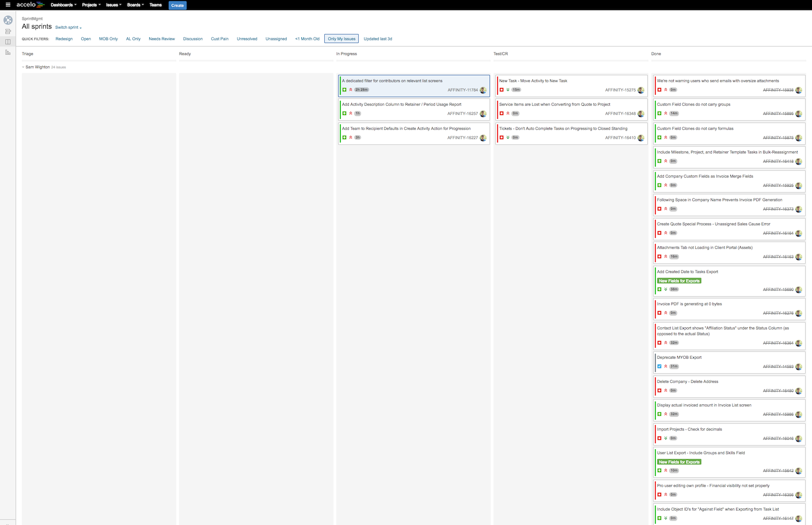

# Sam Wighton

Sam Wighton is a programmer with skills focused on system programming and machine learning

[Professional Career](/#professional-career) |
[Hobbies](/#hobbies) |
[Side Projects](/#side-projects) |
[Education and Research](/#education-and-research) |
[Languages](/#languages)

## Professional Career

### Current Employment at [Accelo](https://www.accelo.com/)

Accelo is a web based suite of applications that automates and assists professional service agencies in the running of their business.

Sam creates and maintains server side code. This involves works on projects, bug fixes and developing internal tools.

Sam is specializing in the code that enforces the business logic of permissions and authorisation. Sam is also often given work that relates to processing [graph-style data](https://en.wikipedia.org/wiki/Graph_theory).

This job involves writing unit tests. Development on projects is often undertaken with a Test Driven Development approach.

Work also involves monitoring the behaviour of code in production. Infrastructure is provided by AWS.

Accelo uses the Elastic stack to provide prompt responses to user actions.

Sam's work at Accelo also involves statistical analysis of the performance of different versions of code while seeking to improve performance.

Sam is able to work quickly. Here is a screenshot of his most recent week long sprint:

(Week ending 2017-07-07. All but two tasks on screen were started that week)

Programmers at Accelo are expected to automate processes to reduce workload. Sam has written static analysis tools to assist in refactoring the codebase.

### Previous Employment at [IMB Bank](http://www.imb.com.au/)

Employed as an Analyst. Also worked as a developer.

Worked on the core legacy system.

Sam created interoperability between the core system and newly installed [teller cash recyclers](https://arca.com/solutions/cash-recycling).

Created web front ends for existing databases.

Wrote a parser to convert human readable database schemas (for the core noSQL database).
This allowed the creation of machine readable schemas and web-based documentation.

Promoted the use of version control (now in place) and automated unit testing.

Sam was requested to met up with a board member of the bank to discuss the modernisation of the development process several times. Even after resigning.

### Contract work

In addition to ongoing employment, Sam also does contract work. (Australian Business Number: 42530866880)

Sam has worked for [Tradimo](https://learn.tradimo.com/about) as a programming coach.
This work involved meeting with traders to discuss how automation through programming can assist with trading. Programs to assist with trading were created and distributed on the site.

Sam has worked with several teams of market traders from all over the world. Developing for them tools and real time analysis software.
One small company paid Sam to work for months developing a machine learning approach to calculate the probability vectors of the 'bounding area' the market would move in immediately after a news event.
Sam is still in frequent contact with the head of this company.

Working for the University of Wollongong and related organisations, Sam created programs to assist in the collection and processing of data for academics.
His work has been acknowledged in three papers, one of which he is co-author.

The program for the above mentioned paper was written to track the movement of maggots observed with thermal and visible-light cameras.

This research allowed a better understanding of the behaviour and temperatures experienced my maggots while in a host.
Temperature affects the growth rate of maggots, so this research has lead to better time-of-death estimations in the field of criminal forensics.

Sam wrote a data conversion program for accountancy firm [PKF Lawler](https://www.pkf.com.au/) to assist with government compliance.

After complaints about sound levels at an auditorium, Sam measured samples of the audio energy levels, created a model of the energy distribution and presented a report to managers.

### Tutoring

Sam has been providing science, mathematics and programming tutoring for secondary school level students for 6 years and is currently still tutoring.

### Public Speaking

Sam has given several programming related talks:

Sam has been invited to speak to the developers or owners of companies on four occasions. These talks were on the topic of machine learning; with the content personalised for each company.

Sam has also talked at meetups and events, and is scheduled to talk at two more events this year.

### Hackathons, Meetups and Conferences

Sam has participated in a few hackathons. His team won ['Best indie Game'](https://www.facebook.com/hackagong/posts/731918936951663:0) at the most recent 'Hackagong'.

Sam has also participated in internal hackathons at Accelo, and has worked with sponsors and promoters at public hackathons.

Sam assists in the running of a Wollongong based Meetup. He has given a beginner level talk on ['A.I. for Business'](https://youtu.be/iovvZ9GlW6A?t=25m55s) at the meetup.

Both for eduction and networking, Sam attends conferences such as the [AWS Summit](https://aws.amazon.com/summits/sydney/) regularly.

## Hobbies

### Rock Climbing

Sam takes advantage of having an [indoor climbing gym](http://hangdog.com.au/) within walking distance of work.

Climbing more complex routes takes skill and planning, not just physical strength.

Sam has developed good relationships with many other climbers and will go climbing often unless currently injured.

### Audio Engineering

The image above is a local band that Sam mixes for once a month.

Part hobby, part volunteering, part professional work. Sam has been recording and mixing audio for more than 14 years.

Skills that have been acquired in this field have found use in other areas of Sam's life. The audio signal chain is a helpful mental model when considering time-series data analysis. The principals of component extraction from a signal are often similar across disciplines.

Sam has written many programs related to processing and analysis of audio data.

## Side Projects

### Kaggle Competitions

On the left is a satellite image of the Amazon rainforest. The image was provided as part of the data set from a [Kaggle competition](https://www.kaggle.com/c/planet-understanding-the-amazon-from-space).
The image on the right is part of the output of a program written by Sam. Colour indicated the algorithm certainty of water (Cyan indicates strong certainty)

This project was undertaken for enjoyment and was written without any machine learning, statistics or maths libraries.
The programming language [Rust](https://www.rust-lang.org/en-US/) was used. A .PNG file parser was written and the pixel colour information of the 40,000 images was analysed.

The goal of the competition was to tag each image in the test set of images with correct labels according to the content of the images.
Enabling the program to output confidence values at a per-pixel resolution provided great insight into the performance of the algorithm during development.

The following shows an example of such output, (at this stage of development, different techniques were being implemented for each tag type)

### Cloud based Audio mastering

Traditionally, analogue [outboard gear](https://en.wikipedia.org/wiki/Outboard_gear) has been used to modify audio signals.
Sam has written many stand-alone tools that can perform similar functions to outboard gear.

Applying machine learning to the audio signal chain has created opportunities for new 'content-aware' tools.
Sam has been writing such tools to be hosted by AWS as a service that could be useful to content creators who want a simple solution.

## Education and Research

A [Higher School Certificate](<https://en.wikipedia.org/wiki/Higher_School_Certificate_(New_South_Wales)>) was achieved by Sam in 2008 after completing high school.

From from 2009 - 2010 Sam studied a Batchelor of Mechatronic Engineering at the [University of Wollongong](https://www.uow.edu.au/index.html).
As part of his studies, Sam learnt the C programming language. A love of this new skill prompted Sam to take on additional Computer Science subjects and change over to a Bachelor of Computer Science.

Reducing from full time study in 2011, Sam began doing programming related contract work. This involved meeting with researchers who worked at the University and developing programs to assist with their research.

Work during this time contributed in a small way to research in biology, forensics and the study of global warming.

Leading on from this work with researchers, Sam co-authored a [research paper in forensics](http://onlinelibrary.wiley.com/doi/10.1111/1556-4029.12472/abstract).

Sam ended his study at the University of Wollongong in 2012 and continued study through online courses.

Sam studied Statistics through the [Massachusetts Institute of Technology OpenCourseWare](https://ocw.mit.edu/index.htm) program. 

Sam began his extensive study of Machine learning through the [Caltech 'Learning from Data'](https://work.caltech.edu/telecourse.html) course.

[Treehouse](https://teamtreehouse.com/home), [Udacity](https://www.udacity.com/), [Coursera](https://www.coursera.org/) and other online education resources provided Sam a strong foundation of programming and Machine Learning knowledge.

Picking contract work that allowed Sam to learn new skills allowed both education and hands on experience with these technologies and techniques.

When time allowed, Sam would write Machine Learning solutions without the use of external libraries.
This 'penance' forced Sam to fully understand every part of the solution down to first principals of mathematics and logic.

After years of this self driven education, Sam is comfortable developing his own techniques for Machine Learning.

Sam started work at IMB in 2015 and completed courses in a variety of Microsoft Business Products sponsored by the business.
In his spare time, Sam continued developing his Machine learning knowledge and a moderate amount of contract work.

In 2016 Sam learnt the programming languages and frameworks in use at Accelo. Several projects required continued study into statistical analysis and Graph Theory.

Sam is always seeking to learn and is flying to California soon to attend the [@Scale](https://atscaleconference.com/) in San Jose.

### Current Machine Learning research

Sam estimates that he spends more than 10 hours a week of his personal time reading research papers and articles on statistics and machine learning.

Although comfortable using libraries such as TensorFlow, Sam enjoys developing his own techniques for data analysis.

Both as a source of education and enjoyment, Sam will seek out problems that may benefit from a machine learning solution (such as the [Numerai Hedge Fund](https://numer.ai/)).

Sam is currently researching two main areas:

Firstly: Investigating pairwise dependence of parameters while calculating probability densities to help avoid overfitting due to the 'curse of dimensionality'.

Creating insights from time series data represented as the interactions of entities in a dynamic graph. Consider the following:

In some systems, there is value in maintaining the current state of an entity.
In such a system, it is then also valuable to modify the system to reduce the probability of the entity changing state.

Activities and communication in this system can be modelled as a series of events describing the creation and modification of edges and nodes in a graph. (A dynamic graph that changes over time)

The behaviour of an entity in this system is understood as a higher level model describing sequences of actions of the entity.

If the system is optimised for maintaining the state of these important entities, then behaviour of any entity that disrupts such a steady state would be considered anomalous and unwanted.

This project would seek to predict future state changes of nodes by modelling the influence of behavioural anomalies in time series graph data.

Such a system could suggest the 'lowest cost' solution to returning the system to a more desirable state.

## Languages

Languages, libraries and frameworks that Sam is comfortable using

#### Rust

Rust is Sam's language of choice for projects that require the creation of fast executable files.

All of Sam's recent audio analysis work is written in Rust. Sam has also used Rust to process satellite imagery as part of a recent Kaggle competition.

Compile time checking of correctness of memory usage, a type system based on the [Hindley-Milner Type System](https://en.wikipedia.org/wiki/Hindley%E2%80%93Milner_type_system), great documentation provided by the Mozilla Foundation, and a maturing package management system make the Rust language a good competitor for tasks previously written in C or C++.

Sam has found Rust a great language to use for in [AWS Lambda](https://aws.amazon.com/lambda/) functions.
Paired with Javascript (for interactions that require the SDK) the compiled Rust program can be called as an external process.
This pairing allows the performance of a low level language and the infrastructure convenience of 'serverless'.

#### Perl

Sam has used Perl throughout his employment at Accelo. Perl is used at Accelo for the creation of API endpoints used by the Accelo application.

#### C and C++

Sam learnt C at University as part of his Batchelor of Mechatronic Engineering. Learning C as a first programming language still influences Sam's coding style.

Sam also learnt C++ at university, C++ become Sam's language of choice for most side projects.

C++ and [SDL](https://www.libsdl.org/) were the key technologies used to create the interface and for data analysis for the research paper Sam co-authored.

#### Python

Sam learnt Python while doing contract work for [PKF Lawler](https://www.pkf.com.au/). The programs created in Python were used to perform data transformation between two different [Superannuation](https://en.wikipedia.org/wiki/Superannuation_in_Australia) accounting systems.

Loved by the academic community, Python has become a great language for tasks that require statistical analysis and/or machine learning techniques.

Sam now uses Python as it provides access to these great libraries: [Caffe](http://caffe.berkeleyvision.org/), [Tensor Flow](https://www.tensorflow.org/), [SciPy](https://www.scipy.org/) and [NumPy](http://www.numpy.org/).

#### Haskell

Sam began to learn Haskell as [recommended by Larry Wall](https://www.youtube.com/watch?v=LR8fQiskYII).

Sam recommends that every programmer learn Haskell even if they never plan to use it in production. The enforced purity of the language will teach great skills that can be taken back to any language that allows a functional style.

Sam has used Haskell at IMB Bank to write documentation creation scripts. Haskell was also a good fit to represent the business logic needed for data conversion at PKF Lawler.

Programs written in Haskell by Sam ran for months without error on a server processing a stream of inbound market data.

#### MQL4

MQL4 is a proprietary language, run as encrypted bytecode inside the [MetaTrader](https://www.metatrader4.com/en) trading platform. MQL4 was the main language used to develop tools for [Tradimo](https://learn.tradimo.com/).

Limited libraries are available for MQL4 so all statistical analysis done by Sam in this language had to be written from first principals.

#### HTML, CSS, SASS, JavaScript, jQuery

Sam initially learnt browser related front end programming from [Team Treehouse](https://teamtreehouse.com/samuelwighton).

These languages are required for some of Sam's work at Accelo. They are also required to create a user interface for many of Sam's side projects.

#### Angular

Sam is required to have a good knowledge of Angular for his work at Accelo. This framework is used for the creation of almost all front end parts of Accelo.

On projects; Sam works with the front end developers to ensure that the API endpoints fulfil the needs of the calls for data from the Angular code.

When working on bug-fixes; Sam needs to understand, write and modify Angular code when required.

#### Node.js

Sam uses Node.js (the JavaScript runtime) for a variety of tasks.

Used at Accelo as a scripting language to quickly perform tasks on the Perl source code.

Used in side projects to pass data between other programs.

Node.js was also used to serve the webpages and data of the dashboards of two of Sam's market analysis programs written for a client.

Sam has most recently used Node.js while creating AWS Lambda functions.

#### Unibasic

Unibasic is a proprietary language used to build the core legacy system in use at IMB Bank. Sam is competent in this language but does not want to use it again.

#### C&#35;

Sam has used C# briefly while creating the game ['Blue Skies'](https://www.facebook.com/hackagong/posts/731918936951663:0) which won the 'Best Indie Game' award at a hackathon.

C# has also been used by Sam at IMB Bank to create web interfaces to existing databases.

#### MySQL / MariaDB

Many different database technologies are in use at Accelo. Sam interacts mostly with MariaDB.
Sam is comfortable writing queries from a shell prompt, calling the database from the Perl code and generating more complex queries from code.

Sam is often tasked with improving the performance of existing queries.

#### MongoDB

Sam learnt MongoDB while working doing some volunteer work for a Not-for-profit organisation and now uses it often at Accelo.

#### Redis, Memcached

Redis and Memcached are in use at Accelo to cache particular queries to other databases. Sam interacts with these in-memory databases when modifying permission logic of the core system.

#### Dgraph

Sam is following the [Dgraph](https://dgraph.io/) project and is interested in this [GraphQL](http://graphql.org/learn/) implementation. Use of this database is currently only experimental.

#### Operating Systems

Sam is comfortable with the GNU/Linux family of operating systems and has been using them in some form since high school. Sam uses CentOS running in [Virtual Box](https://www.virtualbox.org/) at Accelo.

Before working as a programmer, Sam provided 'Tech support' for friends and family. This grew into a small business. Most of this work involved working with the Windows operating system.

Sam uses a Mac Book pro for most of his programming work and is familiar with the operating system.

